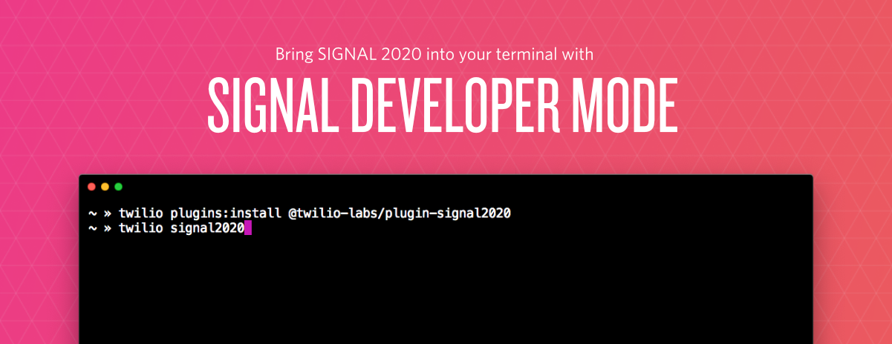

<p align="center"></p>
<h1 align="center">SIGNAL Developer Mode</h1>
<p align="center"><a href="https://github.com/twilio-labs/about"></a></p>

[SIGNAL Developer Mode](https://twil.io/signal-developer-mode) is an augmentation for your experience at Twilio's [SIGNAL 2020 Conference](https://signal.twilio.com).

It's built on top of the [Twilio CLI](https://twil.io/cli) and provides functionality inside your terminal such as:
* __augmented keynote experience__: displaying useful resources, demos and closed-captions as you are watching the keynote
* __access to your full SIGNAL schedule__: view the entire SIGNAL and [SIGNAL TV](https://twitch.tv/twilio) schedule and register for any sessions you are interested in
* __a packed demo section__: explore code samples for a variety of Twilio use-cases and get started in minutes
* __a hidden cheat mode__: find the hidden cheat mode and use it during the keynote session
* and more

### __Table of Contents__

<!-- toc -->
- [Requirements](#requirements)
  - [Setup](#setup)
  - [Supported Terminals](#supported-terminals)
- [Installation](#installation)
  - [Usage](#usage)
- [Commands](#commands)
  - [`twilio signal2020`](#twilio-signal2020)
- [Contributing](#contributing)
  - [Code of Conduct](#code-of-conduct)
- [License](#license)
<!-- tocstop -->
# Requirements

## Setup

You'll need the [Twilio CLI](https://twil.io/cli) to run SIGNAL Developer Mode. Head over to the [Twilio CLI documentation](https://www.twilio.com/docs/twilio-cli/quickstart) to install it.

Additionally, you'll need a ticket to SIGNAL 2020. Register for a free ticket on the [SIGNAL website](https://signal.twilio.com).

## Supported Terminals

SIGNAL Developer Mode should work in any terminal but some terminals might have limited functionality or [display flickering](https://github.com/vadimdemedes/ink/issues/359). 

Some of the terminals that we found that were doing a good job are: [Hyper](https://hyper.is), the built-in macOS Terminal.app and [cmder](https://cmder.net/) on Windows.

For terminals that have known flickering issues we try to detect that and reduce the amount of animations and screen updates. For more info on this check out the [Troubleshooting Guide](docs/TROUBLESHOOTING.md).

SIGNAL Developer Mode will also adapt based on the size of your terminal, however, the bigger your terminal window the better. Alternatively, you can change your terminal font size.

# Installation

```sh-session
$ twilio plugins:install @twilio-labs/plugin-signal2020
$ twilio --help signal2020
USAGE
  $ twilio signal2020
...
```

You'll be prompted for your SIGNAL credentials that you also use to [log into the SIGNAL 2020 website](https://signal.twilio.com/login).

> If you don't want to enter your email and password every time, you can also [store them as environment variables](https://www.twilio.com/blog/2017/01/how-to-set-environment-variables.html) and pass them via the `--email` and `--password` flags to `twilio signal2020`..

## Usage

SIGNAL Developer Mode relies on your keyboard for navigation. Check out the [announcement blog post](https://twil.io/signal-developer-mode) for a detaild walkthrough but here are some common controls:
* <kbd>Ctrl</kbd>+<kbd>C</kbd> will always exit the application
* <kbd>Ctrl</kbd>+<kbd>B</kbd> will toggle the sidebar
* <kbd>&uarr;</kbd> and <kbd>&darr;</kbd> can scroll through lists
* <kbd>&larr;</kbd>, <kbd>&rarr;</kbd>, <kbd>Tab</kbd> and <kbd>Shift</kbd>+<kbd>Tab</kbd> will cycle through different options
* <kbd>Return</kbd>/<kbd>Enter</kbd> and <kbd>Space</kbd> can toggle actions
* <kbd>Ctrl</kbd>+<kbd>D</kbd> exits the Installer and Cheat Mode
* <kbd>W</kbd>, <kbd>K</kbd>, <kbd>S</kbd>, <kbd>D</kbd>, <kbd>R</kbd> let you switch between different modes (see sidebar inside the Developer Mode for more)


# Commands
* [`twilio signal2020`](#twilio-signal2020)

## `twilio signal2020`

```
USAGE
  $ twilio signal2020

OPTIONS
  -d, --diagnostics                Using this flag will output diagnostics information that will be useful when
                                   debugging issues.

  -l=(debug|info|warn|error|none)  [default: info] Level of logging messages.

  -o=(columns|json|tsv)            [default: columns] Format of command output.

  -p, --profile=profile            Shorthand identifier for your profile.

  --email=email                    The email you use to log into signal.twilio.com/login

  --feedback                       Learn how you can give feedback on SIGNAL Developer Mode.

  --password=password              The password you use to log into signal.twilio.com/login

  --tail

ALIASES
  $ twilio signal
```

# Contributing

This project welcomes contributions from the community. Please see the [`CONTRIBUTING.md`](docs/CONTRIBUTING.md) file for more details.

## Code of Conduct

Please be aware that this project has a [Code of Conduct](https://github.com/twilio-labs/.github/blob/master/CODE_OF_CONDUCT.md). The tldr; is to just be excellent to each other ❤️

# License

MIT
